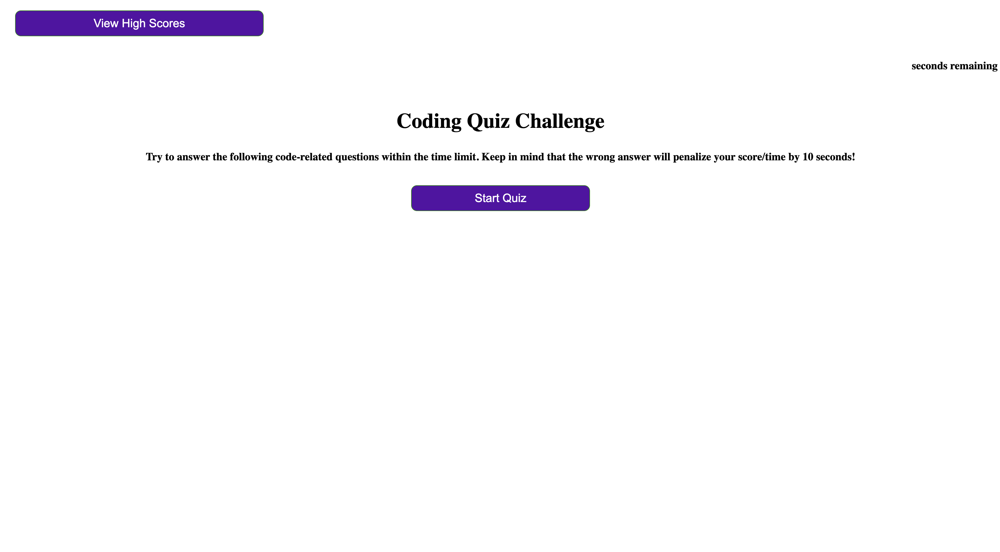
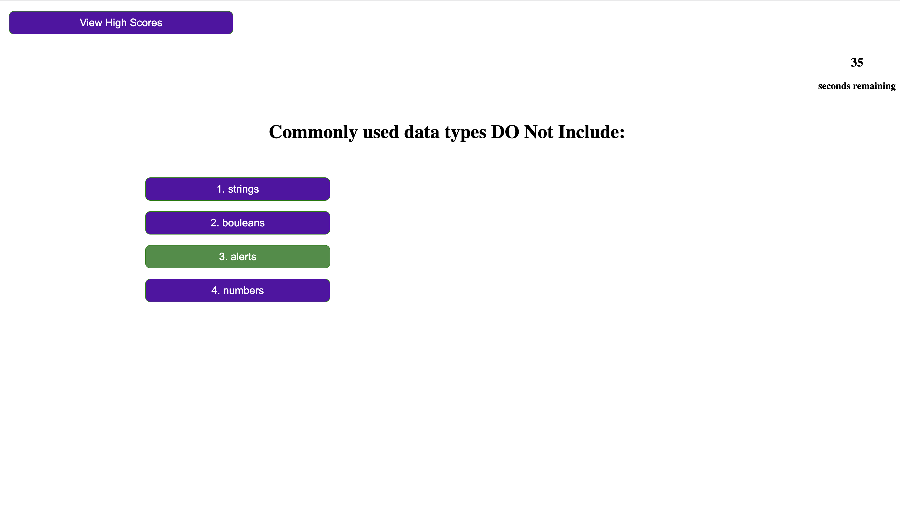
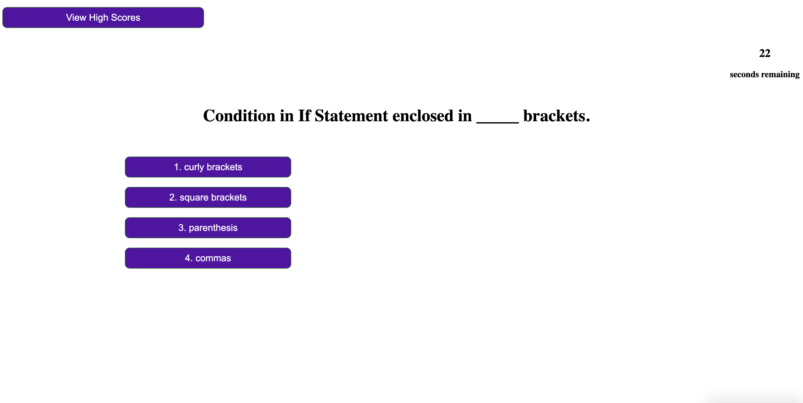
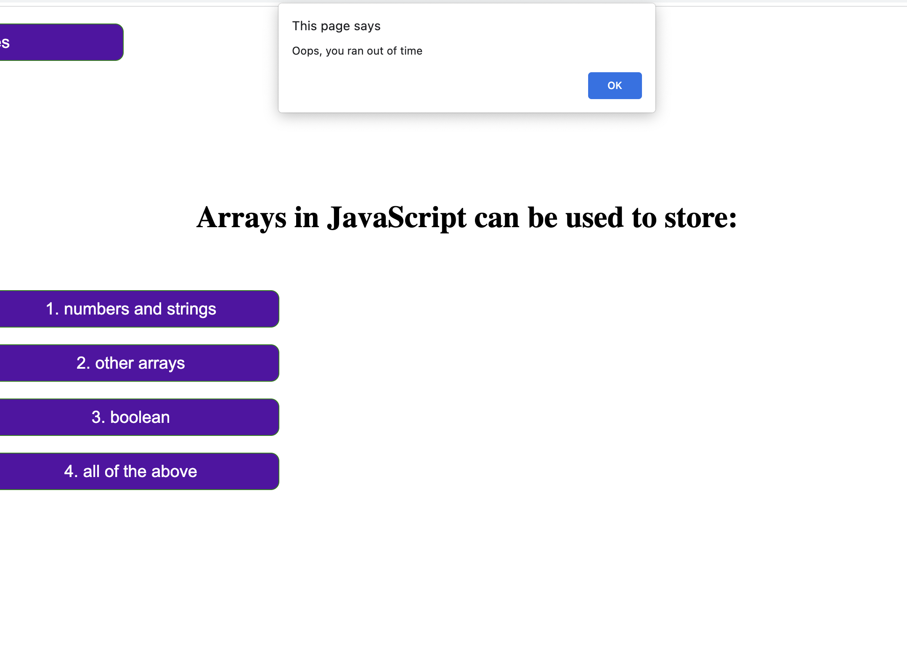
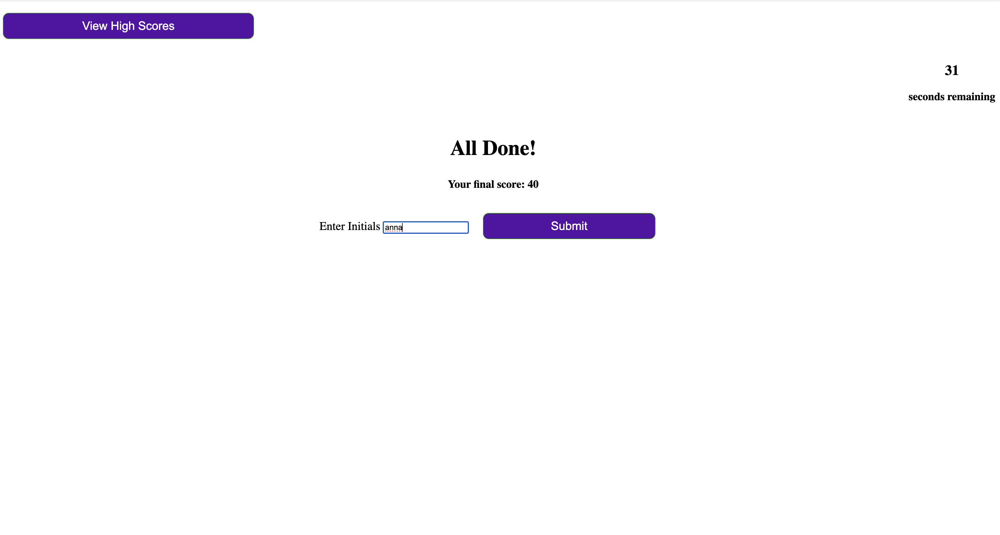
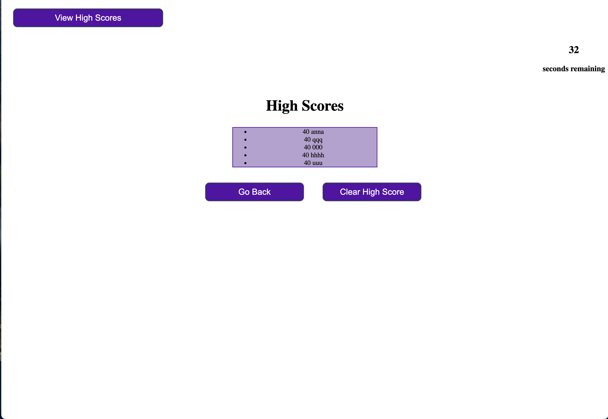

Link to deployed application: https://four-moons-tech.github.io/Coding-Quiz/
Link to github: https://github.com/Four-Moons-Tech/Coding-Quiz

This application is the coding quiz. It consit of 5 questions with 2 options to answer. Upon stating the quiz the timer starts running and decreases by 10 seconds each time to user picks the wrong answer. The score is calculated in the background and increases by 20 points for the right answer and decreased by 20 points for the wrong answer. The maximum score is 100. It is displayed at the end of the quiz, where the user is invited to enter his/her initials. The submit button allows the score to be stored in the local storage. The next page displays 5 highest scores from highest to lowest. 

In this application I used JQuery to hide and show certain sections of the quiz. I hid all but the first one on page load. Throughout the quiz I used JQuery to show hide based on where in the quiz the user is, I used if statement for that. I also used if statement to calculate the score and time left. I put playerRecords in the object and used JSON.stringify to add all the player records to the local storage. I used JSON.parse to get the records from the local storage to create a list item to add to the score-list and display 5 highest scores. Here I used append method to add the list item to the list. 
I used prevent deault funcion when saving the initials to avoid default behavior of the fields upon submittal. I used timer interval to set the timer. I also added a message that shows the user if the answer is wrong or right. Here again used show and hide method with JQuery and set timeout for to hide after 1 second. 

 

